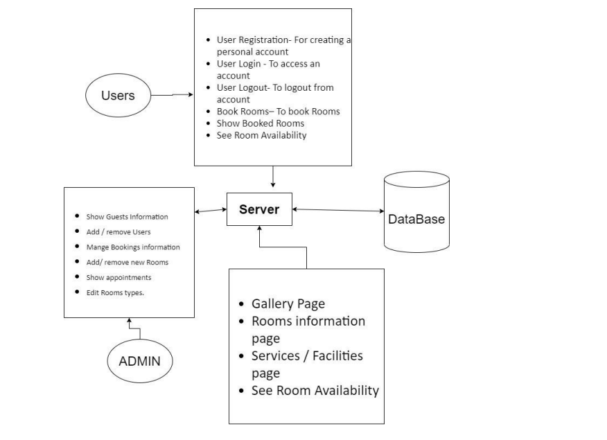

# HOTEL MANAGEMENT SYSTEM
The Hotel Management System is a software application designed to facilitate the efficient management of hotel-related tasks and operations. It caters to the needs of hotel administrators, staff, and guests, providing a comprehensive set of features to streamline various aspects of hotel management. Here's a breakdown of the project's functionality and its target audience.

## Requirements:

Operating System: Windows or Linux   
Integrated Development Environment(IDE): Eclipse   
Java version: 8    
Apache Tomcat version: 9.0    
MySQL version: 8.0.12

## How to Run:

Open the project in Eclipse IDE.    
Set up the Apache Tomcat server.     
Run the project using the run->run on server in Eclipse.      
Access the application in your browser using the URL: http://localhost:****/HotelElite/     
Refer to the block diagram and modules outlined below for a complete understanding of the features.     

## Technologies Used: 
**Language:** Java 14.0.2 (Servlet and JSP)      
**Server:** Apache Tomcat 9.0           
**Database:** MYSQL 8.0.12             
**Frontend:** HTML, CSS, Bootstrap IDE: Eclipse and MYSQL Workbench           

## Modules:

1.  **User Module:**
    
    -   User Registration: Create a personal account.
    -   User Login: Access the created account.
    -   User Logout: Log out from the account.
    -   Show Bookings: Display user's booking history.
2.  **Room Bookings Module:**
    
    -   Book Rooms: Reserve rooms based on date and time.
    -   Show Booked Rooms: View a list of booked rooms.
    -   See Available Room: Check the availability of rooms.
3.  **Hotel Module:**
    
    -   Gallery Page: Showcase images of the hotel.
    -   Room Information Page: Display details about different room types.
    -   Services/Facilities Page: Highlight the amenities provided by the hotel.
    -   About Us Page: Provide information about the hotel.
4.  **Admin Module:**
    
    -   Show Rooms Information: Display information about all rooms.
    -   Add/Remove Users: Manage user accounts.
    -   Manage Rooms Information: Handle details related to rooms.
    -   Add/Remove New Rooms: Modify the room inventory.
    -   Show Bookings: Display a list of all bookings.
## Block diagram

    

